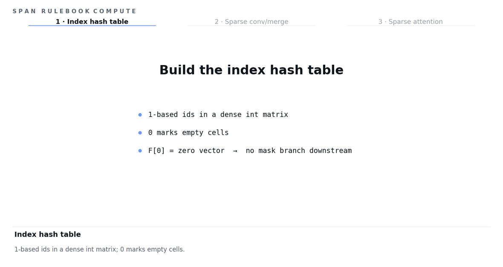

# SPAN

[](https://openaccess.thecvf.com/content/CVPR2026F/papers/Wu_Learning_Spatial-Preserving_Hierarchical_Representations_for_Digital_Pathology_CVPRF_2026_paper.pdf)
[](LICENSE)

Official implementation of **SPAN: Learning Spatial-Preserving Hierarchical Representations for Digital Pathology**.

SPAN is a sparse-native whole-slide-image model for digital pathology. It supports:

* slide-level classification
* patch-level segmentation
* slide-level survival analysis
* reusable sparse hierarchical modeling through `src.span`

Unlike standard MIL models that treat a slide as an unordered bag of patch features, SPAN preserves the spatial layout of WSI patches and builds sparse hierarchical representations directly on the patch grid.

---

## News

* A follow-up work extending SPAN's sparse hierarchical design to cross-modal spatial transcriptomics modeling has been accepted to ICML 2026. The follow-up codebase will also be open-sourced. [ICML 2026 Poster](https://icml.cc/virtual/2026/poster/61463)

<p align="center">
  
</p>

---

## Overview

Whole-slide images are extremely large, but tissue patches usually occupy only a sparse subset of the full slide canvas. SPAN is designed to model this sparse spatial structure directly.

A typical SPAN workflow is:

```text
raw whole-slide images
  -> patch extraction with global WSI coordinates
  -> patch feature extraction
  -> SPAN training / evaluation
```

The recommended preprocessing workflow is:

```text
raw WSIs
  -> modified CLAM patch extraction
  -> PatchPreprocess feature extraction
  -> SPAN training / evaluation through data_root
```

---

## Installation

Clone the repository:

```bash
git clone https://github.com/wwyi1828/SPAN.git
cd SPAN
```

Install dependencies:

```bash
pip install -r requirements.txt
```

---

## Data preparation

SPAN does **not** read raw WSI files directly. It consumes pre-extracted slide-level feature files that contain both patch features and patch coordinates.

We recommend preparing these feature files with [PatchPreprocess](https://github.com/wwyi1828/PatchPreprocess). PatchPreprocess consumes patch folders generated by the modified CLAM preprocessing code at [wwyi1828/CLAM](https://github.com/wwyi1828/CLAM). This CLAM branch keeps patch coordinates aligned to a global 224-step WSI grid, which is the default coordinate convention expected by SPAN.

The coordinate convention matters because SPAN uses the spatial layout of patches to construct sparse hierarchical representations. If you use a custom preprocessing pipeline, please make sure that the saved coordinates are globally aligned WSI patch coordinates rather than arbitrary local coordinates.

Each H5 feature file should correspond to one slide and contain at least:

```text
feats: patch features, shape [num_patches, feature_dim]
cords: patch coordinates, shape [num_patches, 2]
```

Optional fields include:

```text
label:   slide-level label
ratios:  patch-level annotation overlap ratios
caption: optional slide caption
```

The default loader assumes that `cords` are WSI pixel coordinates on a 224-step patch grid. These coordinates are converted to integer patch-grid coordinates internally. Arbitrary floating-point coordinates are not supported by default.

Custom preprocessing pipelines can also be used, as long as they produce compatible feature files with globally aligned patch coordinates.

Set `data_root` to the folder containing the prepared feature files:

```bash
python -m tasks.vision.slide.classification.main \
  data_root=/path/to/features
```

The exact dataset-specific folder names are defined by the corresponding config and dataset loader.

---

## Quick feature-file check

Before training, you can quickly inspect one H5 file:

```python
import h5py

path = "/path/to/features/example_slide.h5"

with h5py.File(path, "r") as f:
    print(list(f.keys()))
    print("feats:", f["feats"].shape)
    print("cords:", f["cords"].shape)
    print("first coords:", f["cords"][:5])
```

Expected fields include `feats` and `cords`. For the default 224 x 224 non-overlapping patch setup, coordinates usually follow a 224-step WSI grid.

---

## Usage

### Slide-level classification

```bash
python -m tasks.vision.slide.classification.main \
  data_root=/path/to/features
```

You can override the dataset and feature variant from the command line:

```bash
python -m tasks.vision.slide.classification.main \
  dataset=C16 \
  features_variant=R50 \
  data_root=/path/to/features
```

### Patch-level segmentation

```bash
python -m tasks.vision.patch.segmentation.main \
  dataset=C16 \
  features_variant=R50 \
  data_root=/path/to/features
```

For patch-level segmentation, each slide should provide patch-level labels or annotation overlap ratios, usually stored as `ratios` in H5.

### Slide-level survival analysis

```bash
python -m tasks.vision.slide.survival.main \
  data_root=/path/to/features
```

If the clinical metadata is stored separately, set:

```bash
export SPAN_CLINICAL_ROOT=/path/to/clinical_metadata
```

or pass it directly:

```bash
python -m tasks.vision.slide.survival.main \
  data_root=/path/to/features \
  clinical_root=/path/to/clinical_metadata
```

---

## Configuration

SPAN uses Hydra configs under:

```text
configs/
```

Common options can be overridden from the command line, for example:

```bash
python -m tasks.vision.slide.classification.main \
  dataset=C16 \
  features_variant=R50 \
  data_root=/path/to/features \
  logging.wandb.enabled=false
```

W&B logging is disabled by default and can be enabled explicitly:

```bash
python -m tasks.vision.slide.classification.main \
  logging.wandb.enabled=true
```

---

## Repository layout

```text
configs/          Hydra configs for vision tasks and model variants
src/span/         Core SPAN modules
tasks/vision/     Classification, segmentation, and survival entrypoints
lib/utils/        Runtime helpers used by the vision tasks
assets/           Figures and README assets
```

---

## Notes

* SPAN expects feature files, not raw WSI files.
* The minimum H5 fields are `feats` and `cords`.
* Patch coordinates should preserve the global WSI layout.
* The default coordinate convention is a 224-step integer patch grid.
* Arbitrary floating-point coordinates are not supported by default.
* The recommended preprocessing path is modified CLAM → PatchPreprocess → SPAN.
* Custom preprocessing pipelines can also be used if they produce compatible patch features and globally aligned coordinates.

---

## Citation

If you find this repository useful, please consider citing our paper:

```bibtex
@inproceedings{wu2026learning,
  title={Learning Spatial-Preserving Hierarchical Representations for Digital Pathology},
  author={Wu, Weiyi and Diao, Xingjian and Zhang, Chunhui and Gao, Chongyang and Xu, Xinwen and Li, Siting and Gui, Jiang},
  booktitle={Proceedings of the IEEE/CVF Conference on Computer Vision and Pattern Recognition},
  pages={5484--5494},
  year={2026}
}
```

---

## License

This code is released under the MIT License.
